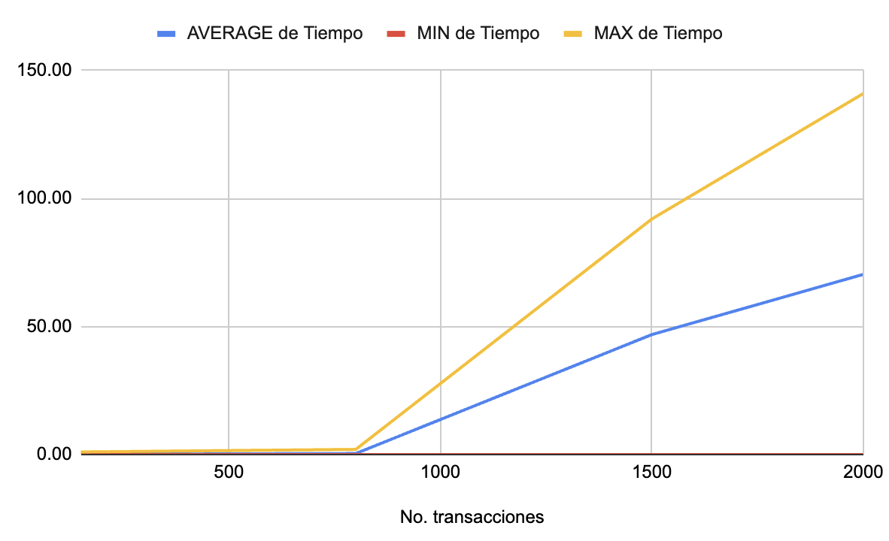
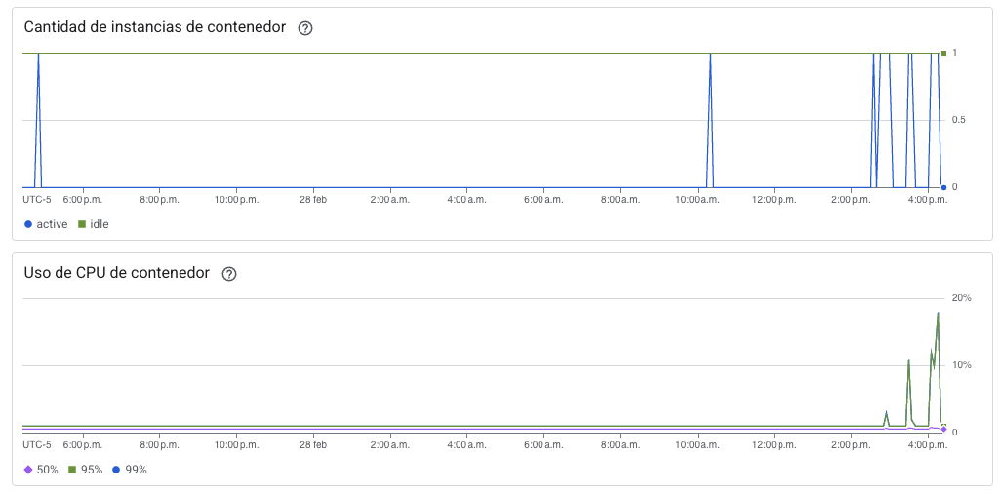
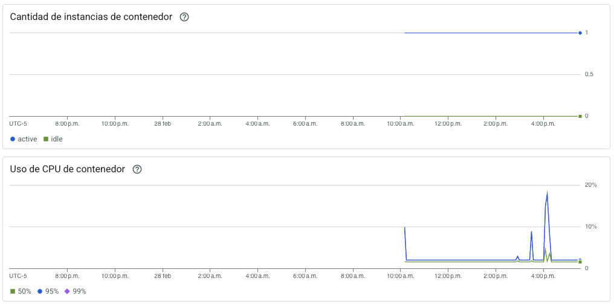

# Análisis de Capacidad - Experimento Servicio de Pagos- Semana 6 - TravelHub

## Integrantes
|Nombres|Correo Uniandes|
|------|------|
|Edwin Cruz Silva|e.cruzs@uniandes.edu.co|
|Omar Andrés Folleco Moncayo|oa.folleco41@uniandes.edu.co|
|Omar Andrés Pava Perez|o.pava@uniandes.edu.co|
|Pablo José Herrera Rivera|p.riverah@uniandes.edu.co|

## Contexto
Se configuro en GCP una arquitectura en Cloud Run para el servicio de Pagos de la aplicación TravelHub. Para esta entrega, hemos configurado y desplegado todo el servicio interno de Pagos.

## Objetivos
* Comparar el comportamiento de la aplicación bajo carga creciente.
* Determinar si la arquitectura permite mantener niveles aceptables de rendimiento (Tiempo de respuesta) frente a un aumento progresivo en el número de usuarios concurrentes, teniendo en cuenta los escenarios de calidad realizados (Confirmación de pagos en 3 segundos para 150 TPM con picos de 800 TPM).
* Medir y analizar el porcentaje de errores HTTP (principalmente 5xx).

## Herramienta de pruebas de carga
Apache JMeter versión 5.6.3.  Se seleccionó porque es una herramienta madura, ampliamente utilizada, con capacidad de simular cientos de usuarios concurrentes. Su interfaz permite diseñar flujos complejos.

## Entorno de pruebas
|||
|------|------|
|Capa Webhook (API REST)|GCP Cloud Run: 1 Servicio|
|Capa Worker|GCP Cloud Run: 1 Grupo de trabajo|
|Cola de mensajeria|GCP Pub/Sub|
|Software|- Backend: Python - Frameworks: FastAPI, SQLAlchemy, Celery (Concurrencia=4) - Base de datos: Cloud SQL (PostgreSQL) |
|Red|Región GCP: us-central1|

## Criterios de aceptación
* Las pruebas de carga deben ser ejecutadas sobre ambas configuraciones bajo condiciones equivalentes (misma herramienta, duración, número de usuarios).
* Se deben registrar métricas como: tiempo de respuesta promedio, tiempo de respuesta máximo, número de errores y throughput (transacciones por segundo).
* El análisis debe destacar si con la arquitectura es viable con las metricas obtenidas en los diferentes escenarios.

## Escenarios de pruebas
|Id|Nombre||
|------|------|------|
|Ah005|Registro de pagos|1. Registro de pago en la cola de mensajeria (Pub/Sub). 2. Registrar pago en Base de datos.|

## Parámetros de configuración
|Parámetro|Valor|
|------|------|
|Usuarios concurrentes|150, 800, 1500, 2000|
|Ramp-Up (Tiempo para lanzar los usuarios simulados)|60 segundos|
|Duración de la prueba|10 minutos por carga|

## Resultados ejecución escenario No. 1: Registro pagos.

### Tiempo de respuesta promedio del proceso completo (ms)
| # Usuarios  | Segundos                 |
|-------------|--------------------------|
| 150         | 0.10                     |
| 800         | 0.39                     |
| 1500        | 46.84                    |
| 2000        | 70,36                    |

---
### Tiempo de respuesta máximo (ms)
| # Usuarios  | Segundos                 |
|-------------|--------------------------|
| 150         | 1                        |
| 800         | 2                        |
| 1500        | 92                       |
| 2000        | 141                      |

---
### Errores (%)
| # Usuarios  | % Errores                |
|-------------|--------------------------|
| 150         | 0%                       |
| 800         | 0%                       |
| 1500        | 0%                       |
| 2000        | 0%                       |

---
### Throughput
| # Usuarios  | Throughput (T/sec)       |
|-------------|--------------------------|
| 150         | 2.5                      |
| 800         | 13.3                     |
| 1500        | 25                       |
| 2000        | 33.3                     |

---
### % peticiones por encima del nivel de servicio
| # Usuarios  | %                        |
|-------------|--------------------------|
| 150         | 0                        |
| 800         | 0                        |
| 1500        | 97.20%                   |
| 2000        | 97.25%                   |
---

### Uso de CPU instancias

#### Webhook (Servicio de Cloud Run)

Para todos los TPM se consigio esto: 
- Cantidad de instancias: 1
- Uso de CPU: <20%

#### Worker (Grupo de Trabajo de Cloud Run)

Para todos los TPM se consigio esto: 
- Cantidad de instancias: 1
- Uso de CPU: <20%

---

## Conclusiones
- Con la arquitectura actual, el sistema opera de manera estable y sin errores en un rango de **150 a 800 TPM**, manteniendo tiempos de respuesta del proceso completo **inferiores al nivel de servicio definido (3 segundos)**. Esto demuestra que la configuración vigente cumple adecuadamente con los requerimientos actuales del negocio.

  - En este rango de carga, el comportamiento es consistente, sin degradación significativa en latencia ni fallos transaccionales, lo que indica una correcta distribución de recursos y un procesamiento eficiente de las tareas.

- A partir de **1500 y 2000 TPM**, más del **97% de las transacciones superaron los 3 segundos**, evidenciando que el aumento del throughput impacta directamente los tiempos de respuesta. No se observa necesariamente una falla funcional, sino una saturación progresiva de la capacidad de procesamiento bajo la configuración actual.

## Recomendaciones
- Para la demanda actual (**150–800 TPM**), la arquitectura puede considerarse **apta para producción**, cumpliendo el SLA establecido sin necesidad de ajustes inmediatos.

- Si el negocio proyecta crecimiento en volumen transaccional, se recomienda explorar estrategias de escalabilidad horizontal antes de realizar cambios estructurales mayores, por ejemplo:

  - Incrementar la **concurrencia en Celery** de forma controlada.
  - Aumentar el número de **instancias de workers**.

- Estas medidas permitirían absorber incrementos de carga (como escenarios de **1500–2000 TPM**) sin rediseñar la arquitectura completa, optimizando el uso de recursos y manteniendo tiempos dentro del SLA.

- Se sugiere realizar pruebas periódicas de carga conforme crezca la demanda, para ajustar oportunamente parámetros como concurrencia, número de instancias y límites de CPU/memoria, asegurando así una escalabilidad progresiva y controlada.

## Archivos relevantes
- [Consultar Scripts](scripts/payment-service-test.jmx)
- [Registro de Solicitudes](https://docs.google.com/spreadsheets/d/1AcwhXzp_62oYs6z0yTk1SYvogQJTZB4Fedp61DlKnIU/edit?usp=sharing)